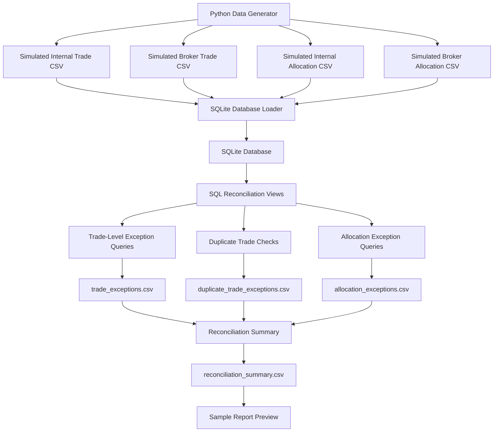
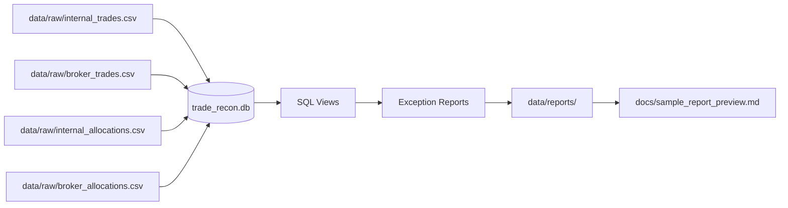
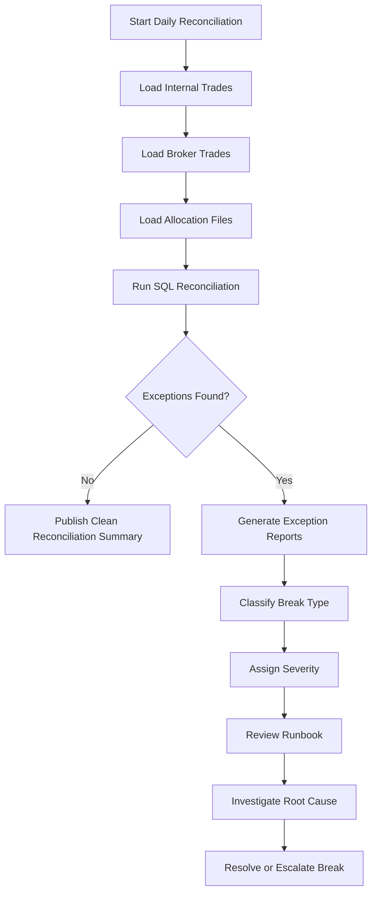

# Project Architecture

This document describes the end-to-end architecture of the Trade Reconciliation SQL Project.

The project simulates a daily trade reconciliation workflow where internal trade bookings are compared against broker-reported trade and allocation records.

---

## High-Level Workflow

---

## Component Overview

| Component | File or Folder | Purpose |
|---|---|---|
| Data generator | `src/generate_data.py` | Creates simulated internal, broker, and allocation datasets |
| Raw data | `data/raw/` | Stores generated CSV input files |
| SQL schema | `sql/01_create_tables.sql` | Defines database tables |
| Reconciliation views | `sql/02_reconciliation_views.sql` | Creates reusable SQL views for matching records |
| Exception queries | `sql/03_exception_queries.sql` | Defines exception logic for trade breaks |
| Database loader | `src/load_database.py` | Loads CSV files into SQLite |
| Reconciliation runner | `src/run_reconciliation.py` | Runs SQL logic and exports reports |
| Output reports | `data/reports/` | Stores CSV exception reports |
| Report preview generator | `src/export_report_preview.py` | Converts generated reports into Markdown preview documentation |
| Tests | `tests/` | Validates that expected reconciliation outputs are produced |

---

## Data Flow

---

## Reconciliation Logic

The core reconciliation joins internal and broker records using the simulated `execution_id`.

The SQL checks for:

- Missing records on either side
- Quantity differences
- Price differences
- Buy/sell side differences
- Symbol differences
- Fee differences
- Settlement date differences
- Allocation account differences
- Duplicate execution IDs

---

## Operational Control Design

---

## Why This Architecture Works for a Portfolio Project

This architecture is intentionally simple but realistic.

It demonstrates:

- End-to-end data flow
- SQL-based investigation
- Repeatable reconciliation controls
- Separation between raw data, SQL logic, scripts, reports, and documentation
- A workflow that maps clearly to trading operations and production support responsibilities

---

## Future Architecture Upgrade

A more production-like version could replace SQLite with PostgreSQL and add:

- Docker Compose
- Database schemas for `raw`, `staging`, `controls`, and `reporting`
- Scheduled reconciliation runs
- Exception aging
- SLA tracking
- Dashboard reporting
- Audit logs
- Alerting for high-severity breaks
