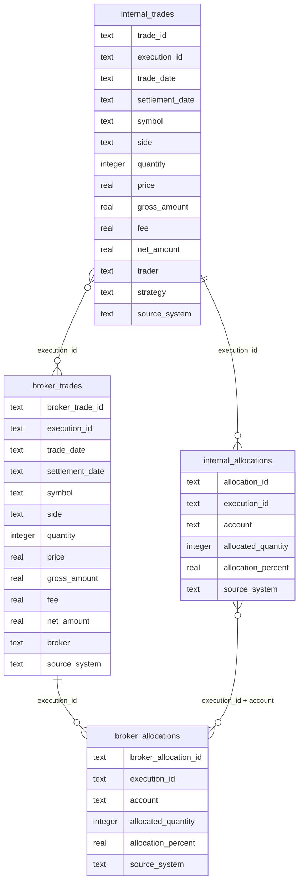

# Database Schema and ERD

This document describes the simulated database schema used in the Trade Reconciliation SQL Project.

The project uses four main input tables:

- `internal_trades`
- `broker_trades`
- `internal_allocations`
- `broker_allocations`

The common linking field is the simulated `execution_id`.

---

## Entity Relationship Diagram



---

## Table Purpose

| Table | Purpose |
|---|---|
| `internal_trades` | Simulated internal trade bookings |
| `broker_trades` | Simulated broker-reported trades |
| `internal_allocations` | Simulated internal account-level allocations |
| `broker_allocations` | Simulated broker account-level allocations |

---

## Matching Logic

Trade-level reconciliation uses:

```text
internal_trades.execution_id = broker_trades.execution_id
```

Allocation-level reconciliation uses:

```text
internal_allocations.execution_id = broker_allocations.execution_id
AND
internal_allocations.account = broker_allocations.account
```

---

## Why This Schema Matters

This schema supports common reconciliation checks:

- Missing internal or broker records
- Quantity mismatches
- Price mismatches
- Side mismatches
- Symbol mismatches
- Fee mismatches
- Settlement date mismatches
- Duplicate execution IDs
- Allocation account mismatches

---

## Production-Style Considerations

In a more production-like PostgreSQL version, the schema could include:

- Primary keys
- Foreign keys
- Indexes on `execution_id`
- Indexes on `trade_date`
- Batch IDs for reconciliation runs
- Audit columns such as `created_at` and `loaded_at`
- Exception status fields such as `OPEN`, `RESOLVED`, or `ESCALATED`
